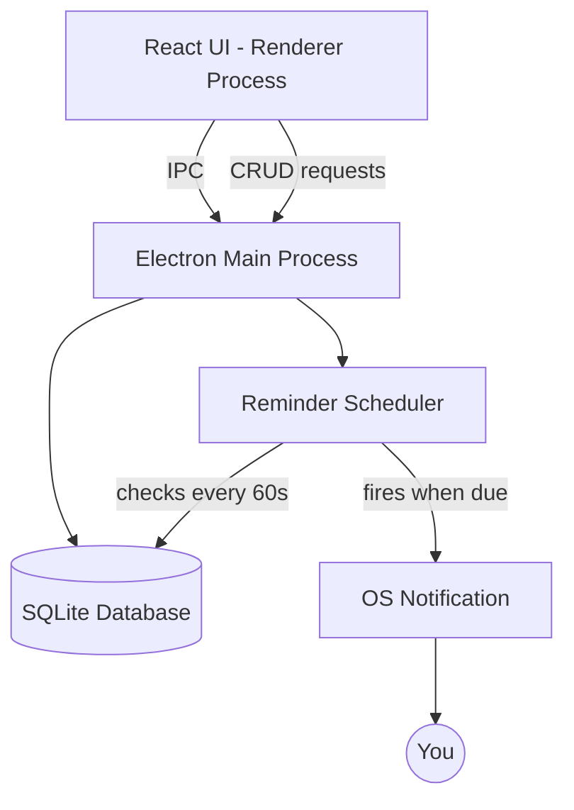

# University Task & Deadline Tracker — Architecture

A desktop app (Windows / Mac / Linux) to track assignments, quizzes, and lab
submissions, with local reminders/alerts so you never miss a deadline.

---

## 1. Core Features (v1)

- Add a task: title, course, type (assignment / quiz / lab / exam), deadline
  (date + time), priority, notes
- Dashboard: upcoming tasks sorted by due date, overdue tasks highlighted
- Reminders: desktop notification X hours/days before deadline (configurable)
- Mark task as done / snooze / delete
- Filter by course or type
- All data stored **locally** (no login required, works offline)

### Nice-to-have (v2+)
- Recurring tasks (e.g. weekly lab)
- Calendar view
- Export to `.ics` (import into Google/Outlook calendar)
- Cloud backup/sync across devices (optional, needs a backend)

---

## 2. Recommended Tech Stack

| Layer | Choice | Why |
|---|---|---|
| App shell / UI | **Electron** + **React** | One codebase → Windows, Mac, Linux installers. Huge community, easy to style, easy to find help. |
| Language | **TypeScript** | Type safety, fewer bugs, better autocomplete. |
| Local database | **SQLite** (via `better-sqlite3`) | Zero-config, file-based, perfect for single-user desktop data. |
| Notifications | Electron's built-in `Notification` API | Native OS notification bar, no extra service needed. |
| Background scheduling | `node-schedule` or a simple `setInterval` check loop | Checks the DB every minute for due reminders, even while app is minimized/tray. |
| Packaging | `electron-builder` | Produces `.exe`, `.dmg`, `.AppImage` installers. |

### Simpler alternative (if you know Python, not JS)

| Layer | Choice |
|---|---|
| UI | **PySide6 (Qt for Python)** |
| Database | **SQLite** (`sqlite3` built into Python) |
| Notifications | `plyer.notification` |
| Scheduling | `APScheduler` |
| Packaging | `PyInstaller` |

Pick Electron/React if you're more comfortable with web tech (HTML/CSS/JS) or
want a modern-looking UI fast. Pick Python/PySide if you already know Python
and want fewer moving parts.

**This document assumes the Electron + React + SQLite stack** for the folder
structure and schema below — the same concepts map directly if you choose
the Python route instead.

---

## 3. High-Level Architecture



- **Renderer process (React)**: the window you see — forms, task list, dashboard.
- **Main process (Electron/Node)**: owns the database, runs the background
  reminder-check loop, and triggers OS notifications. The renderer never
  touches the DB directly — it always goes through IPC (`ipcRenderer.invoke`).
- **SQLite file**: stored in the app's user-data folder, e.g.
  `%APPDATA%/university-tracker/data.db` on Windows.

---

## 4. Data Model

```sql
CREATE TABLE tasks (
    id            INTEGER PRIMARY KEY AUTOINCREMENT,
    title         TEXT NOT NULL,
    course        TEXT,
    type          TEXT CHECK(type IN ('assignment','quiz','lab','exam','other')) DEFAULT 'assignment',
    due_date      TEXT NOT NULL,        -- ISO 8601, e.g. 2026-10-05T23:59:00
    priority      TEXT CHECK(priority IN ('low','medium','high')) DEFAULT 'medium',
    notes         TEXT,
    status        TEXT CHECK(status IN ('pending','done')) DEFAULT 'pending',
    reminder_offset_minutes INTEGER DEFAULT 1440,  -- default: remind 24h before
    reminder_sent BOOLEAN DEFAULT 0,
    created_at    TEXT DEFAULT CURRENT_TIMESTAMP
);
```

`reminder_sent` prevents the scheduler from notifying you twice for the same task.

---

## 5. Project Folder Structure

```
university-tracker/
├── package.json
├── electron-builder.yml
├── src/
│   ├── main/                  # Electron main process
│   │   ├── main.ts            # app entry, window creation
│   │   ├── db.ts              # SQLite setup + queries
│   │   ├── scheduler.ts       # background reminder loop
│   │   └── ipcHandlers.ts     # CRUD endpoints exposed to renderer
│   ├── preload/
│   │   └── preload.ts         # secure bridge (contextBridge)
│   └── renderer/               # React app
│       ├── App.tsx
│       ├── components/
│       │   ├── TaskForm.tsx
│       │   ├── TaskList.tsx
│       │   ├── Dashboard.tsx
│       │   └── FilterBar.tsx
│       ├── hooks/
│       │   └── useTasks.ts
│       └── styles/
└── assets/
    └── icon.png
```

---

## 6. Reminder Logic (Scheduler)

Pseudocode for `scheduler.ts`, run every 60 seconds via `setInterval` in the
main process:

```
every 60 seconds:
    now = current time
    tasks = SELECT * FROM tasks
             WHERE status = 'pending'
               AND reminder_sent = 0
               AND due_date - reminder_offset_minutes <= now

    for each task in tasks:
        show OS notification: "⏰ {task.title} due {relative_time}"
        UPDATE tasks SET reminder_sent = 1 WHERE id = task.id
```

Also check on app startup, in case the app was closed when a reminder was due.

---

## 7. Build Roadmap

1. **Scaffold**: `npm create vite@latest` (React + TS template) → wrap with
   Electron using `electron-vite` boilerplate.
2. **DB layer**: set up SQLite table, write add/update/delete/list functions.
3. **IPC bridge**: expose those DB functions safely to the renderer via
   `contextBridge` in `preload.ts`.
4. **UI**: build the task form and list first, dashboard/filters after.
5. **Scheduler**: add the background interval + `Notification` calls.
6. **Polish**: system tray icon, "launch on startup" option, dark mode.
7. **Package**: `electron-builder` to produce installers for your OS(es).

---

## 8. Optional Later: Cloud Sync

If you later want your tasks to sync across your laptop and another device,
you'd add a small backend (e.g. Firebase Firestore, or a simple REST API +
Postgres) and sync local SQLite ↔ cloud on app start/close. Not needed for v1.
